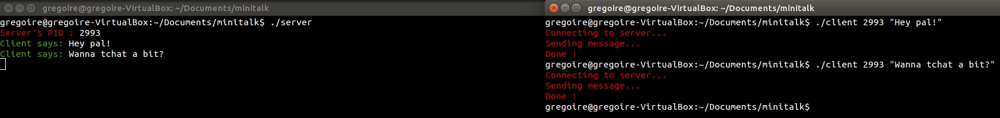

minitalk
========

### What is it?
Minitalk is a tiny client-server program in C. It has been developed in March 2011.

### Instructions project
- Communication between the client and the server must be using only signals SIGUSR1 and SIGUSR2
- The server must display the string as fast as it can
- The server must handle multiple clients

### Authors and Contributors
Developed by Gregoire Borel (@gregoireborel)
